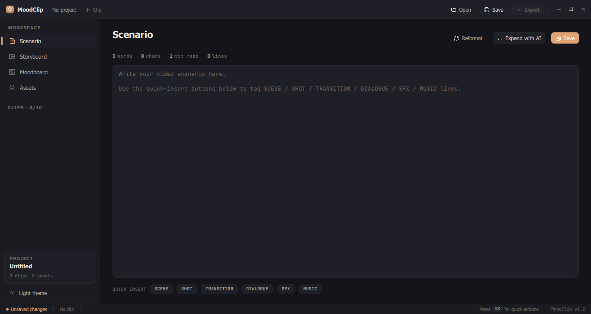

# 🎬 MoodClip

**[English](#-english)** · **[Русский](#-русский)**

---

<a name="-english"></a>

## 🇬🇧 English

**AI Video Pre-Production Suite** — a desktop tool for planning, scriptwriting, storyboarding, and assembling visual references when creating AI videos and clips.

> Like Obsidian — but for your AI video pipeline.



---

### Why

Creating AI video isn't "write a prompt → get a clip." It's a process:

```
💡 Idea
  ↓
📝 Script      — narrative, pacing, atmosphere, scene tags
  ↓
🎞 Storyboard  — shot breakdown with a prompt for each frame
  ↓
🎨 Moodboard   — visual references, color palette, style
  ↓
📦 Assets      — file library with tags and categories
  ↓
🤖 Export      — .md / .json ready for ComfyUI, Runway, Pika...
```

The entire pipeline — in one window, one project, offline.

---

### Features

#### Four workspaces

| Tab | What's inside |
|-----|---------------|
| **📝 Script** | Editor with `[SCENE]` `[SHOT]` `[SFX]` `[MUSIC]` tags — monospaced, clean, no clutter |
| **🎞 Storyboard** | Grid of frame-pages: description + AI prompt + notes + image for each frame |
| **🎨 Moodboard** | Infinite canvas: sticky notes (6 colors), images, text labels, connector lines. Zoom 0.1×–5× |
| **📦 Assets** | SQLite library with 200×200 previews, tags, categories, filtering, and a usage counter |

#### Projects
- 1 Project = up to 10 Clips
- Save to a folder (Git-friendly) or a `.moodclip` archive
- JSON format — readable and versionable

#### AI Export
- **Markdown** — script + all frames with prompts + references. Ready to feed into a model
- **JSON** — structured data for automated pipelines

#### Design
- **Light theme** — warm paper tones `#F4F1EA`, earthy accents
- **Dark theme** — deep black `#1E1E24`, the same harmonious palette
- Animated theme switching (400 ms)

---

### Tech Stack

| Component | Technology |
|-----------|------------|
| Language | C++20 |
| UI | Qt 6 + QML + QuickControls2 |
| Build | CMake |
| Database | SQLite 3 (asset library) |
| Serialization | JSON |
| Platform | Windows (MSYS2 UCRT64), macOS, Linux |

---

### Building from Source

#### Dependencies (Windows — MSYS2 UCRT64)

```bash
pacman -S mingw-w64-ucrt-x86_64-qt6-base \
          mingw-w64-ucrt-x86_64-qt6-declarative \
          mingw-w64-ucrt-x86_64-qt6-quickshapes \
          mingw-w64-ucrt-x86_64-cmake \
          mingw-w64-ucrt-x86_64-ninja
```

#### Build

```bash
export PATH="/c/msys64/ucrt64/bin:$PATH"
bash build_manual.sh
```

Or manually:

```bash
export PATH="/c/msys64/ucrt64/bin:$PATH"
cmake -B build -G Ninja \
  -DCMAKE_PREFIX_PATH=/c/msys64/ucrt64 \
  -DCMAKE_BUILD_TYPE=Release
cmake --build build
```

#### Run

```bash
export PATH="/c/msys64/ucrt64/bin:$PATH"
cd compile
./MoodClipConsole.exe
```

> ⚠️ **Important:** always run via bash with MSYS2 on PATH. From PowerShell/cmd you'll get `0xC0000139`. Details — see [Qt QML Gotchas](#qt-qml-gotchas).

---

### Keyboard Shortcuts

| Keys | Action |
|------|--------|
| `Ctrl+S` | Save project |
| `Ctrl+N` | New project |
| `Ctrl+E` | Export dialog |
| `← / →` | Navigate storyboard frames |
| `Space + Drag` | Pan the moodboard |
| `Ctrl + Scroll` | Zoom the moodboard |

---

### Example Workflow

```
1. New project → "Cyberpunk Alley Scene"
2. Add clip → "Clip 01"

3. Script:
   [SCENE]  Rain-slicked cyberpunk alley, neon reflections
   [SHOT]   Wide establishing shot, slow pan right
   [SFX]    Distant thunder, dripping water, synth drone
   [MUSIC]  Low bass pulse, rising tension

4. Storyboard:
   Frame 1: "Wide shot, cyberpunk alley, neon rain, 8k, cinematic"
   Frame 2: "Close-up eyes, cybernetic implants, shallow DOF"

5. Moodboard:
   → Drag in references
   → Add color sticky notes
   → Connect related ideas with lines

6. Export → .md → feed into Runway / Pika / ComfyUI
```

---

### Qt QML Gotchas

During development, a list of **13 critical Qt6/QML issues** was compiled — ones that aren't properly documented anywhere official.

If you use **Claude Code** — a skill with the full breakdown is available here:

```bash
mkdir -p ~/.claude/skills/qt-qml-cpp
curl -o ~/.claude/skills/qt-qml-cpp/SKILL.md \
  https://gist.githubusercontent.com/SnikzSoundProd/4eed9e6fdf2b70707217c5b71698bf28/raw/qt-qml-cpp.md
```

Especially handy if you take prototypes from **Claude Artifacts / Claude Design** and build them into a Qt app.

---

### Roadmap

- [ ] `.moodclip` ZIP archive (save/load)
- [ ] Drag & drop from the Asset Library onto the Moodboard
- [ ] Autosave
- [ ] Undo/redo stack for the moodboard
- [ ] Preview player (frame sequence)
- [ ] ComfyUI workflow JSON export
- [ ] Runway / Pika API integration
- [ ] Cloud sync

---

### License

MIT — use, modify, and distribute freely.

---

*Built for AI video artists who think before they prompt.*

---
---

<a name="-русский"></a>

## 🇷🇺 Русский

**AI Video Pre-Production Suite** — десктопный инструмент для планирования, написания сценариев, раскадровки и сборки визуальных референсов при создании ИИ-видео и клипов.

> Как Obsidian — но для вашего AI-видео пайплайна.


---

### Зачем это нужно

Создание ИИ-видео — это не «написал промпт → получил клип». Это процесс:

```
💡 Идея
  ↓
📝 Сценарий    — нарратив, темп, атмосфера, теги сцен
  ↓
🎞 Сторибоард  — раскадровка с промптами под каждый кадр
  ↓
🎨 Мудборд     — визуальные референсы, цветовая палитра, стиль
  ↓
📦 Ассеты      — библиотека файлов с тегами и категориями
  ↓
🤖 Экспорт     — .md / .json готовый для ComfyUI, Runway, Pika...
```

Весь этот пайплайн — в одном окне, в одном проекте, офлайн.

---

### Возможности

#### Четыре рабочих пространства

| Вкладка | Что внутри |
|---------|------------|
| **📝 Сценарий** | Редактор с тегами `[SCENE]` `[SHOT]` `[SFX]` `[MUSIC]` — моноширинный, чёткий, без лишнего |
| **🎞 Сторибоард** | Сетка кадров-страниц: описание + AI-промпт + заметки + изображение на каждый кадр |
| **🎨 Мудборд** | Бесконечный канвас: стикеры (6 цветов), картинки, текстовые метки, соединительные линии. Зум 0.1×–5× |
| **📦 Ассеты** | SQLite-библиотека с превью 200×200, тегами, категориями, фильтром и счётчиком использования |

#### Проекты
- 1 Проект = до 10 Клипов
- Сохранение в папку (Git-friendly) или `.moodclip` архив
- JSON-формат — читаемый и версионируемый

#### Экспорт для AI
- **Markdown** — сценарий + все кадры с промптами + референсы. Готово для подачи в модель
- **JSON** — структурированные данные для автоматизированных пайплайнов

#### Дизайн
- **Светлая тема** — тёплые бумажные тона `#F4F1EA`, землистые акценты
- **Тёмная тема** — глубокий чёрный `#1E1E24`, та же гармоничная палитра
- Анимированное переключение тем (400 ms)

---

### Стек технологий

| Компонент | Технология |
|-----------|------------|
| Язык | C++20 |
| UI | Qt 6 + QML + QuickControls2 |
| Сборка | CMake |
| База данных | SQLite 3 (библиотека ассетов) |
| Сериализация | JSON |
| Платформа | Windows (MSYS2 UCRT64), macOS, Linux |

---

### Сборка из исходников

#### Зависимости (Windows — MSYS2 UCRT64)

```bash
pacman -S mingw-w64-ucrt-x86_64-qt6-base \
          mingw-w64-ucrt-x86_64-qt6-declarative \
          mingw-w64-ucrt-x86_64-qt6-quickshapes \
          mingw-w64-ucrt-x86_64-cmake \
          mingw-w64-ucrt-x86_64-ninja
```

#### Сборка

```bash
export PATH="/c/msys64/ucrt64/bin:$PATH"
bash build_manual.sh
```

Или вручную:

```bash
export PATH="/c/msys64/ucrt64/bin:$PATH"
cmake -B build -G Ninja \
  -DCMAKE_PREFIX_PATH=/c/msys64/ucrt64 \
  -DCMAKE_BUILD_TYPE=Release
cmake --build build
```

#### Запуск

```bash
export PATH="/c/msys64/ucrt64/bin:$PATH"
cd compile
./MoodClipConsole.exe
```

> ⚠️ **Важно:** всегда запускать через bash с MSYS2 на PATH. Из PowerShell/cmd получите `0xC0000139`. Подробности — в [Qt QML Gotchas](#qt-qml-gotchas).

---

### Горячие клавиши

| Клавиши | Действие |
|---------|----------|
| `Ctrl+S` | Сохранить проект |
| `Ctrl+N` | Новый проект |
| `Ctrl+E` | Диалог экспорта |
| `← / →` | Навигация по кадрам сторибоарда |
| `Space + Drag` | Панорамирование мудборда |
| `Ctrl + Scroll` | Зум мудборда |

---

### Пример рабочего процесса

```
1. Новый проект → "Cyberpunk Alley Scene"
2. Добавить клип → "Clip 01"

3. Сценарий:
   [SCENE]  Rain-slicked cyberpunk alley, neon reflections
   [SHOT]   Wide establishing shot, slow pan right
   [SFX]    Distant thunder, dripping water, synth drone
   [MUSIC]  Low bass pulse, rising tension

4. Сторибоард:
   Кадр 1: "Wide shot, cyberpunk alley, neon rain, 8k, cinematic"
   Кадр 2: "Close-up eyes, cybernetic implants, shallow DOF"

5. Мудборд:
   → Перетащить референсы
   → Добавить цветовые стикеры
   → Соединить связанные идеи линиями

6. Экспорт → .md → подать в Runway / Pika / ComfyUI
```

---

### Qt QML Gotchas

При разработке был собран список из **13 критических проблем** Qt6/QML, которые официально нигде нормально не задокументированы.

Если вы используете **Claude Code** — скилл с полным разбором доступен здесь:

```bash
mkdir -p ~/.claude/skills/qt-qml-cpp
curl -o ~/.claude/skills/qt-qml-cpp/SKILL.md \
  https://gist.githubusercontent.com/SnikzSoundProd/4eed9e6fdf2b70707217c5b71698bf28/raw/qt-qml-cpp.md
```

Особенно полезно, если берёте прототипы из **Claude Artifacts / Claude Design** и собираете из них Qt-приложение.

---

### Roadmap

- [ ] `.moodclip` ZIP архив (сохранение/загрузка)
- [ ] Drag & drop из Asset Library на Moodboard
- [ ] Автосохранение
- [ ] Undo/redo стек для мудборда
- [ ] Плеер предпросмотра (последовательность кадров)
- [ ] Экспорт ComfyUI workflow JSON
- [ ] Интеграция с Runway / Pika API
- [ ] Облачная синхронизация

---

### Лицензия

MIT — используйте, модифицируйте, распространяйте свободно.

---

*Создано для AI-видеохудожников, которые думают перед тем как промптить.*
